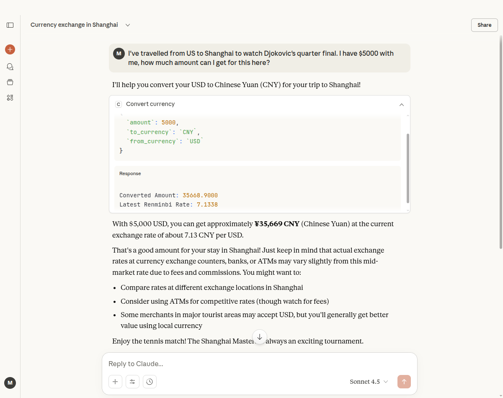

# Model Context Protocol (MCP) Currency Server

This is a simple MCP server built with Python and [UV](https://docs.uv.dev/) that provides two AI-callable tools for currency conversion:

- `convert_currency`: Converts an amount from one currency to another.
- `list_currencies`: Lists all supported currencies via the external [Currency API](https://currency.getgeoapi.com).

It is provided on _"as-is"_ basis for educational purpose. 

---

## Prerequisites

Make sure you have the following installed on your computer/laptop.

- Python 3.10+
- [Claude Desktop](https://claude.ai/download) to test your MCP server
- [UV](https://docs.astral.sh/uv/getting-started/installation/) for dependency management and running the MCP server.

## Setup Weather API Key

1. Get a free API key for [Currency API](https://currency.getgeoapi.com/register/)
2. Export the API key in your environment, run this in a terminal:

    ```bash
    export CURRENCY_API_KEY=your_api_key_here
    ```

## Installation

1. **Clone the repository:**
   ```bash
   git clone https://github.com/manishh/mcp-server-demo
   cd <project-directory>
   ```

2. **Create Virtual Environment:**
   ```bash
   uv venv
   ```


3. **Activate the virtual environment:**
   ```bash
   # macOS/Linux
   source .venv/bin/activate

   # Windows
   .venv\Scripts\activate
   ```

4. **Install dependencies:**
   ```bash
   uv sync
   ```

Now you have everything you need for your MCP server.

## Run the MCP Server

This server uses `stdio` as the transport mechanism, making it easy to integrate with local AI agents like Claude for Desktop.

To run the server, use:

```bash
 uv run currency.py
```

If all goes well, you'll see output like this in the terminal:

```bash
$ uv run currency.py
[10/11/25 12:29:32] INFO     Got the API key? True                                                                          
                    INFO     Running MCP Currency Server...            
```

## Test the MCP Server

You may also test the MCP server by listing its tools using:

```bash
python test_mcp.py
```

This should show you the JSON for available tools. The test code uses raw JSON-RPC requests, and it is helpful for understanding MCP's standardized request-response. 

## Integrating with Claude for Desktop:

Ensure you have [Claude Desktop](https://claude.ai/download) available on your computer/laptop. Use the following configuration for Claude Desktop's `claude_desktop_config.json`:

```json
{
  "mcpServers": {
    "currency": {
        "command": "/absolute-path-to-executable/uv",
        "args": [
          "--directory",
          "/absolute-path-to/mcp-server-currency",
          "run",
          "currency.py"
        ],
        "env": {
          "CURRENCY_API_KEY": "<your-API-key>"
        }
    }
  }
}
```

> **Note:** You will be able to use locally running MCP server with Claude's free plan as well.

## Currency MCP Server In Action:



---

&copy; 2025 Manish Hatwalne

